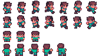

# Pokemon-style Game 🎮

A 2D Pokemon-inspired adventure game built with [Bevy Engine](https://bevyengine.org/) using Rust.



## 🚀 Features

- **Character Movement**: Smooth 4-directional character movement with arrow keys
- **Sprite Animation**: Dynamic character animations for walking and idle states
- **World Exploration**: Navigate through Kanoko Town with collision detection
- **Background Music**: Area-specific BGM system that plays/stops based on player location
- **Camera System**: Smooth camera following the player character
- **Environment Objects**: Trees, houses, and other obstacles with proper collision

## 🎯 Game Controls

- **Arrow Keys**: Move character (Up/Down/Left/Right)
- **Character automatically animates** based on movement direction
- **Camera follows** the player smoothly

## 🏗️ Project Structure

```
src/
├── main.rs              # Game entry point
├── entities/            # Game entities (future organization)
├── plugins/             # Bevy plugins for different systems
│   ├── camera_plugin.rs    # Camera follow system
│   ├── character_plugin.rs # Character movement & animation
│   └── kanoko_plugin.rs     # Kanoko Town world setup
└── systems/             # ECS Systems and Components
    ├── components/          # Data components
    │   ├── animation.rs     # Animation & Character components
    │   └── obstacle.rs      # Collision system components
    ├── worlds/             # World/Map systems
    │   └── kanoko.rs       # Kanoko Town setup & BGM
    ├── animation_systems.rs # Animation & movement logic
    └── character_systems.rs # Character setup

assets/
├── gabe-idle-run.png        # Character sprite sheet
├── kanoko_town/             # Town assets (backgrounds, BGM)
└── utils/                   # Environment sprites (trees, grass, sea)
```

## 🛠️ Technical Details

### Architecture
- **ECS (Entity Component System)** using Bevy's built-in ECS
- **Plugin-based architecture** for modular game systems
- **Component-driven design** for character animation and collision

### Key Components
- `Character`: Player state and animation configurations
- `AnimationConfig`: Sprite animation timing and frames
- `Obstacle`: Collision boundaries for environment objects
- `Player`: Player entity marker

### Systems
- **Movement System**: Handles player input and character translation
- **Animation System**: Updates sprite frames based on character state
- **Camera System**: Smooth camera following with constraints
- **BGM System**: Area-based background music management
- **Collision System**: Environment obstacle detection

## 🚀 Getting Started

### Prerequisites
- [Rust](https://www.rust-lang.org/tools/install) (latest stable version)
- Git

### Installation

1. **Clone the repository**
   ```bash
   git clone https://github.com/kenta-afk/real-pokemon.git
   cd real-pokemon
   ```

2. **Run the game**
   ```bash
   cargo run
   ```

### Development

- **Debug mode**: `cargo run` (default)
- **Release mode**: `cargo run --release` (better performance)
- **Check code**: `cargo check`
- **Run tests**: `cargo test`

## 🎨 Assets

The game uses pixel art assets including:
- Character sprite sheets with walking animations
- Environmental textures (grass, sea, trees)
- Building and town backgrounds
- Background music (OGG format)
- grass color is attached #77de34

## 🔧 Configuration

### Animation Settings
Character animations can be configured in `src/systems/components/animation.rs`:
- Frame rates (FPS)
- Sprite sheet indices
- Animation loops

### World Setup
Town layout and object placement configured in `src/systems/worlds/kanoko.rs`:
- Environment object positions
- Collision boundaries
- BGM trigger areas

## 🤝 Contributing

1. Fork the repository
2. Create your feature branch (`git checkout -b feature/AmazingFeature`)
3. Commit your changes (`git commit -m 'Add some AmazingFeature'`)
4. Push to the branch (`git push origin feature/AmazingFeature`)
5. Open a Pull Request

## 📝 Development Roadmap

- [ ] Refactor to entities-based architecture (`entities/player.rs`, `entities/enemy.rs`)
- [ ] Add Pokemon battle system
- [ ] Implement inventory management
- [ ] Add more towns and areas
- [ ] Create enemy NPCs with AI
- [ ] Add sound effects
- [ ] Implement save/load system

## ⚡ Performance

- Built with Bevy 0.16.1 for optimal 2D rendering
- ECS architecture for efficient system updates
- Sprite batching for improved draw calls
- Asset streaming for memory management

## 🙏 Acknowledgments

- [Bevy Engine](https://bevyengine.org/) - Amazing Rust game engine
- Pixel art assets (sources to be credited)
- Community tutorials and examples

---

**Made with ❤️ and Rust**
